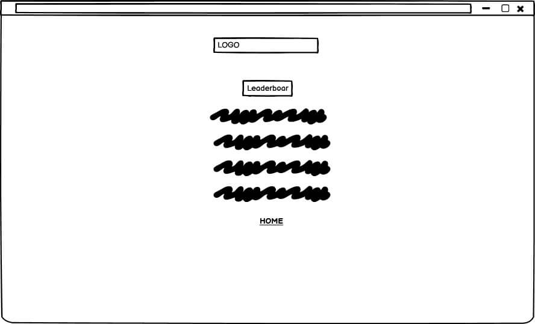

# Description 
- ‘Behind the blur’ is a virtual game, designed to quiz users on their awareness of vast general knowledge across the world. The questions within the game are related to well-known celebrities and established organisations within distinct sectors.  
   The main objective of the game is to ensure all users gain contrasting knowledge in an enjoyable manner. To ensure all users are aware of the correct answer, I have included functions that specifically highlights the true answer when answered false. To enhance the quiz entertainment objective, I combined pixilated images throughout the game to engage the user and fixate their attention.

# UX
- The game has been named 'Behind the blur' due to the nature of the game. This design has been kept very simple yet color contrasting in a subtle manor, so it is easier for the user to find the way around the site.
Style of this site has been kept the same throughout every page of the game to keep the consistency, i.e background image, font style and buttons used. 
### **Home Page:**
- The home page has been created in a simplified format. To make the page more apparent, I selected a dark background with lighter lettering. This page contains two definitive links :

### **Quiz Page:**
- This page is where the users will be taken part in the quiz. For quality and consistency purposes, this page contains the same colour scheme as the other pages in the game and the game logo is visible and allocated in the same position throughout the game. 

### **High Score Page:**
- The high score page has been created to help users oversee their scores and keep track of their achievements. This page format is aligned with all the other pages within the game. 

# Wireframe
- Wireframes were made at the start of the project to create a specific framework for this website. 
### **Wireframe Screenshots:**

  

  

  

#  Visual Identity

# Site Overview
Following Images are screenshots of the site overvire from a desktop: 

Home Page 

  

Quiz Page 

  

Points Page 

  

Highscores Page 

  

#  User Stories
### **Player:**
- As a user, I would like the game to be created in a simplistic format. There should be no complications when finding my way to the quiz page. 
- As a user, I would like there to be knowledgeable questions about contrasting personalities and organistions within the quiz.
- As a user, I would like to know if the answer selected in the quiz was right. 
- As a user I would like hints in order for me to ease my way if I am struggling to chose the right answer. 
- As a user, if needed, I would like to overlook previous scores and achievements.
- As a user, I would like the game to track my overall score after every quiz to signify my success.

### **Actions taken to accomplish these goals are:**
- For the user to find the way around the quiz, this project has been kept as simple as possible with clear instructions. 
- For the user to test their knowledge, various questions from different fields have been added. 
- For the user, correct answer is shown once the user has selected their answer.
- To help the user where stuck, I have added hints button giving information about that particular personality or organisation. 
- For the user to keep track of their correct answers, points section has been added; which is updated after every correct selection made. 
- For the user to keep track of their previous scores, I have added High Score page where they scores from every quiz played are saved. 

# Deployment

# Code Validation

# Testing

# Technologies

# Acknowledgement
 
