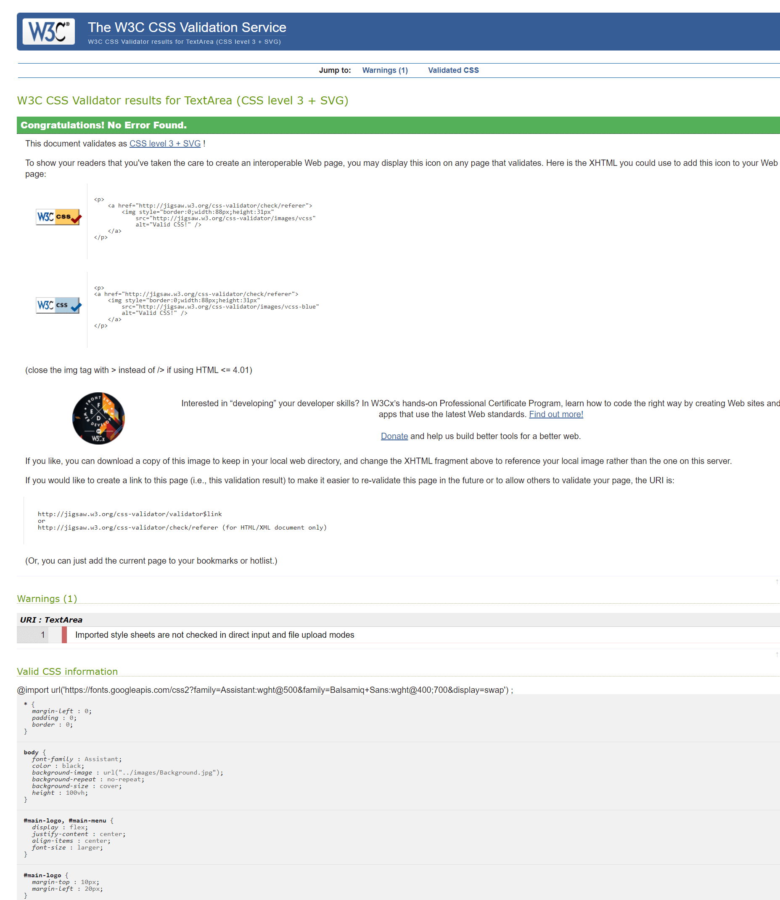
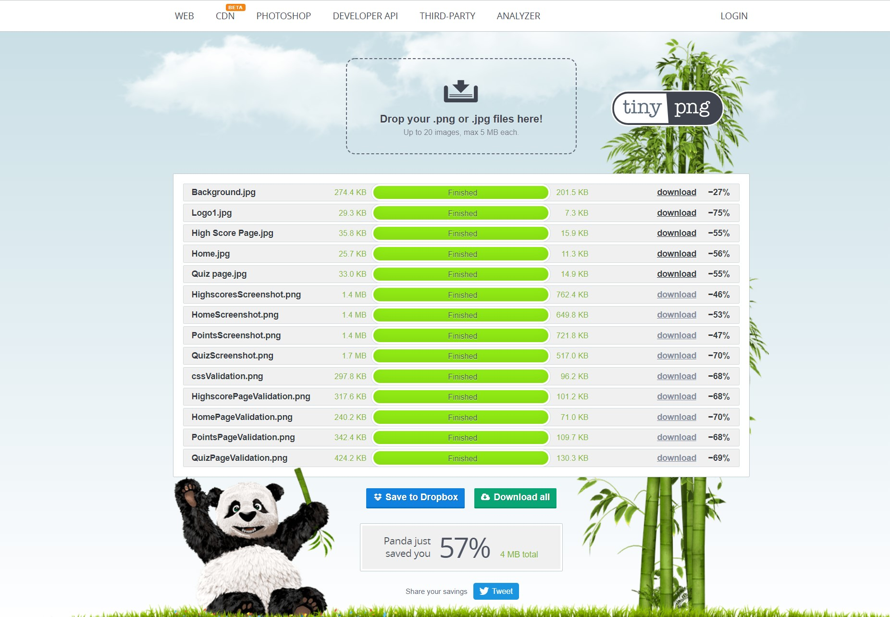

  

# Description 
- ‘Behind the blur’ is a virtual game, designed to quiz users on their awareness of vast general knowledge across the world. The questions within the game are related to well-known celebrities and established organisations within distinct sectors.  
   The main objective of the game is to ensure all users gain contrasting knowledge in an enjoyable manner. To ensure all users are aware of the correct answer, I have included functions that specifically highlights the true answer when answered false. To enhance the quiz entertainment objective, I combined pixilated images throughout the game to engage the user and fixate their attention.

# UX
- The game has been named 'Behind the blur' due to the nature of the game. This design has been kept very simple yet color contrasting in a subtle manor, so it is easier for the user to find the way around the site.
Style of this site has been kept the same throughout every page of the game to keep the consistency, i.e background image, font style and buttons used. 
### **Home Page:**
- The home page has been created in a simplified format. To make the page more apparent, I selected a dark background with lighter lettering. This page contains two definitive links :

### **Quiz Page:**
- This page is where the users will be taken part in the quiz. For quality and consistency purposes, this page contains the same colour scheme as the other pages in the game and the game logo is visible and allocated in the same position throughout the game. 
There is a question shown with a blurred image on this page. Four options are provided for the user to select the correct answer while giving a hint if needed. This page also contains points to keep track of correct answers throughout the quiz.

- Once the quiz is over, site leads you onto 'Points Page'. Points page contains total points scored throughout this quiz with name input and finally a save button to save the score. 

### **High Score Page:**
- The high score page has been created to help users oversee their scores and keep track of their achievements. This page format is aligned with all the other pages within the game. This page contains a list of high scoring players including a button to lead them back to the home page. 

# Wireframe
- Wireframes were made at the start of the project to create a specific framework for this website. 
### **Wireframe Screenshots:**

  

  

  

#  Visual Identity
To begin the designing process, I created a distinct wireframe. This was later used as guidance when constructing the characteristics of the site. As the layout developed, I formatted the brand logo using a webpage called ‘BrandCrowd’. Keeping the nature of the game as a priority, the name of the game was chosen as ‘Behind the Blur’. 

Two key objectives of the game are to keep it simple and intriguing. To enhance these factors, I have chosen the colour theme throughout the game to be a solid dark background with contrasting bright buttons that can be selected to link to other pages of the game. Furthermore, another desirable key element of the game is consistency. To achieve this, I have kept all key features such as the logo, colour theme, and font persistent on all pages of the game.

The Home page is designed to be very minimal. This aspect is to establish the user can navigate around the game easily. It consists of a logo at the top of the page to create clear identification of the game, followed by a message and two links; Home Page -> Quiz and Home Page -> High Score.

The quiz page contains a blurred image, a text box in the middle of the screen containing a pre-written question that could help the user identify the blurred image, and four possible answers. Once the answer has been selected, I have used CSS and Javascript to ensure the correct answer will be highlighted for the user. 

Once the quiz has been completed, a final points page has been created to appear on the user's screen. This page displays the points achieved in the quiz and requests the user to save the score for the high score page. When this is completed, I have given the user a choice of restarting the quiz or going back to the home page.

The High Score page has been produced to enable the user to keep track of all points scored in previous games. To keep it very straightforward yet informative, the page consists of a clear heading, a list of the previous scores, and a link button to go back to the home page.

# Site Overview
Following Images are screenshots of the site overview from a desktop: 

Home Page 

  

Quiz Page 

  

Points Page 

  

Highscores Page 

  

#  User Stories
### **Player:**
- As a user, I would like the game to be created in a simplistic format. There should be no complications when finding my way to the quiz page. 

- As a user, I would like there to be knowledgeable questions about contrasting personalities and organistions within the quiz.

- As a user, I would like to know if the answer selected in the quiz was right. 

- As a user I would like hints in order for me to ease my way if I am struggling to chose the right answer. 

- As a user, if needed, I would like to overlook previous scores and achievements.

- As a user, I would like the game to track my overall score after every quiz to signify my success.

### **Actions taken to accomplish these goals are:**
- For the user to find the way around the quiz, this project has been kept as simple as possible with clear instructions. 

- For the user to test their knowledge, various questions from different fields have been added. 

- For the user, correct answer is shown once the user has selected their answer.

- To help the user where stuck, I have added hints button giving information about that particular personality or organisation. 

- For the user to keep track of their correct answers, points section has been added; which is updated after every correct selection made. 

- For the user to keep track of their previous scores, I have added High Score page where they scores from every quiz played are saved. 

# Deployment
The site has been deployed to github and is accessible on github-pages:

  

# Code Validation
- All my code has been validated through [W3C Markup Validation Service](https://validator.w3.org/) and the [CSS Validation Service.](https://jigsaw.w3.org/css-validator/)
When the code was tested there were 2 errors given. First error was to warn me for having a link inside a button which was fixed and link function was then added using javascript to lead onto the path required. 
Second error was a type error in CSS file which was also fixed accordingly. 
Results for the valdiation are as follow: 

Home Page 

  

Quiz Page 

  

Points Page 

  

Highscore Page 

  

CSS Validation 

  

# Testing
 

 I used TinyPNG to compress the images without making any changes to the size.

  

To test the website, I used GTmetrix. The results are as follow:

  

### Testing Steps(s):
Following steps demonstrate how all the functions in the quiz work. Also, how language pairing has been used to create this quiz:

1. Clicking on 'Play' link on Home screen leads the user onto the quiz page, where the shuffled initial question is loaded. 

2. In the beginning, there is a question followed by a blurred image and a choice of answers, a hint button and points scored. 

3. If a user is unaware of the answer, the Hint button has been created which, on clicking, toggles down a clue for a set amount of time, related to the given question.

4. Once an answer is selected, CSS classes pair up with JavaScript, where the buttons will change colour, depending on correct and incorrect value. 

5. The 'Next' button appears once an answer is selected to lead the user to the following question. Which after the last question changes its value to 'Final Score' button. 

6. Finishing the quiz page; Points have been added, updated by a 100 after every correct answer selected. 	

7. Once the Quiz has ended, Final Score button appears, on clicking, which leads you to the Points page. 

8. LocalStorage has been used in order to display the points on Points page. 

9. Save button is provided for the user to save the points in local storage which is called in a list on Highscores page. 

### Scalability:
To improve the quiz multiple functions will be added in the near future. 

1. Set timer to answer the question, giving the user less time to figure out the answer. 

2. Deducted points when hint used or incorrect answer selected. 

3. Decreasing the level of blur (will cost points) to make the image clearer for hint purposes.

# Technologies
I have used several useful resources in order to make this website, such as:

- [HTML5](https://en.wikipedia.org/wiki/HTML5) was used for the code for content of this website.

- [CSS3](https://en.wikipedia.org/wiki/CSS) was used to style the content of this website. 

- [Bootstrap4](https://getbootstrap.com/) was used to add navigation menu on quiz page and also to organise the content in a grid format. 

- [Balsamiq](https://balsamiq.com/)was used to create the wireframes to initiate the design for this website. 

- [BrandCrowd](https://www.brandcrowd.com/)  was used to make the Logo for the website.

- [Google Font](https://fonts.google.com/)  was used all through the website for font.

- [Font Awesome](https://fontawesome.com/) was used for the icons used for the website. 

- [TinyPNG](https://tinypng.com/) was used to compress the images without making any changes to the size. 

- [GTmetrix](https://gtmetrix.com/) was used to test the speed of the website. 

- [JSHint](https://jshint.com/) was used to test all the javascript files. 

# Acknowledgement
 
I would like to thank code institute, for all the help and support provided through the modules. 
Felipe, my mentor, has once again been a great help for providing me with an idea of this project and for rescuing me from any unwanted situation. 
I would like to thank Tim from tutor support, who helped me resolve the issues I had. 
Also, technologies I have used, such as [w3School](https://www.w3schools.com/) and [Slack](https://slack.com/intl/en-gb/) to help me achieve the final version of this site.
